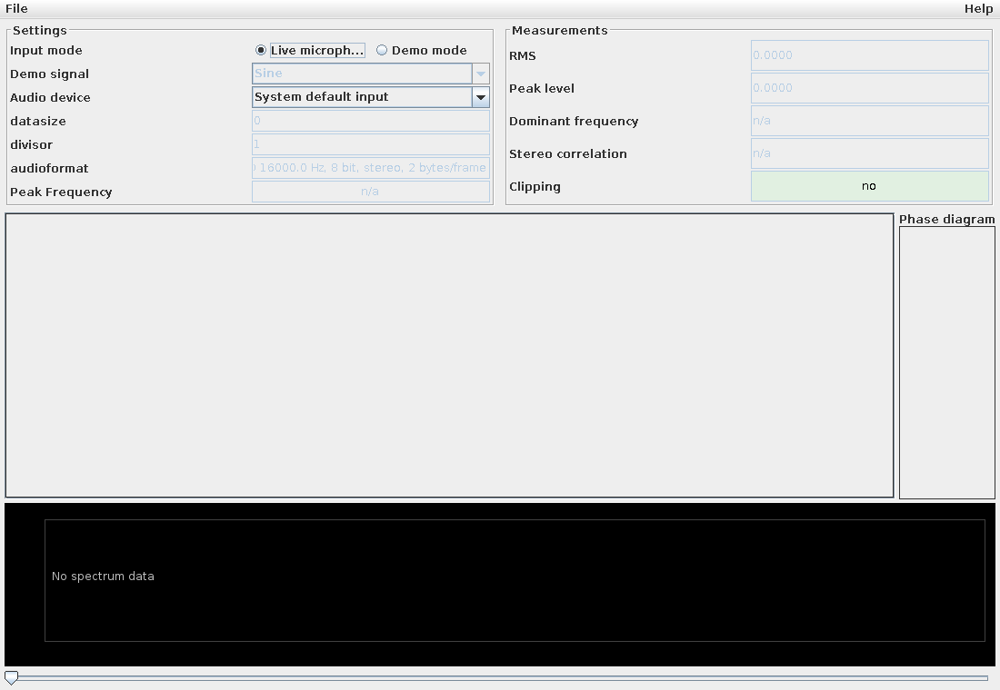
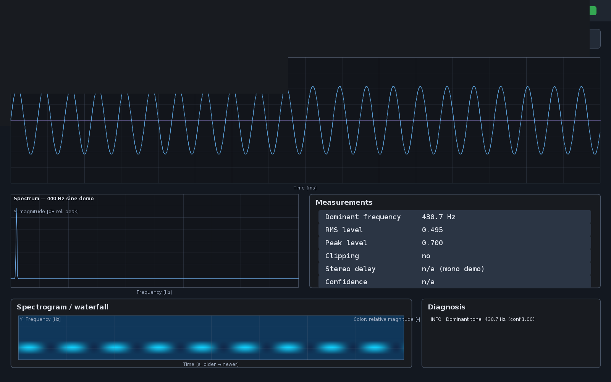

# Audio Analyzer

[](https://github.com/carstenartur/javarepos/actions/workflows/maven.yml)
[](https://codecov.io/gh/carstenartur/javarepos)
[](https://github.com/carstenartur/javarepos/actions/workflows/codeql.yml)

**Audio Analyzer** is a modular real-time audio processing platform built around a Java/Swing
demo. It provides a layered architecture for audio acquisition, ring-buffering, DSP, analysis
(RMS/peak, FFT spectrum) and visualization, with deterministic synthetic signal generators and
JMH benchmarks. The bundled Swing UI renders a live waveform and phase diagram of the system
audio input.

> The Maven artifact is named `audioin` for historical reasons; the application is **Audio Analyzer**.

## Features

- **Layered architecture** — capture → ring buffer → DSP pipeline → analysis → snapshots → UI.
  See [`ARCHITECTURE.md`](ARCHITECTURE.md).
- **Immutable audio domain** — `AudioBlock` and `AudioFormatDescriptor` carry normalized
  `float[channels][frames]` samples, frame indices and timestamps; no UI types.
- **Lock-free SPSC ring buffer** for realtime workloads, with `offer` and `offerOverwrite`.
- **DSP extension points** — implement `DSPProcessor` and chain stages with `DSPPipeline`.
- **Analysis modules** — `RmsPeakAnalyzer`, `SpectrumAnalyzer` (pure-Java radix-2 FFT) producing
  immutable snapshots suitable for any UI or remote API.
- **Deterministic synthetic signals** — `SineGenerator`, `SquareGenerator`, `ChirpGenerator` for
  tests, headless demos and DSP verification.
- **Live Swing UI** — selectable microphone input, waveform, phase diagram, FFT spectrum,
  demo mode (sine/square/chirp), pause/freeze, peak-frequency + measurement readouts, and CSV/PNG
  export for quick acoustic diagnostics.
- **Headless-friendly tests** — 81 unit tests covering immutability, FFT correctness, SPSC
  concurrency stress, signal determinism, DSP pipeline composition and sample decoding.
- **JMH benchmarks** for ring buffer throughput, FFT throughput and signal-generator
  allocations.
- **Java 21**, no heavyweight frameworks.

## Quickstart

Requires **Java 21** or higher.

```bash
# Build, test, run static analysis and coverage
./mvnw clean verify

# Run the application
java -jar target/audioin-0.0.1-SNAPSHOT.jar

# Run JMH benchmarks
./mvnw -Pjmh package
java -jar target/audioin-0.0.1-SNAPSHOT.jar  # see exec-maven-plugin config
```

On Windows use `mvnw.cmd` instead of `./mvnw`.

## MVP workflow



## UI screenshot (modern dashboard)



`docs/images/screenshot.png` is the reserved path for the current dashboard screenshot.
If the file is missing in your checkout, regenerate it with:

1. Run the app (`java -jar target/audioin-0.0.1-SNAPSHOT.jar`) and switch to demo mode.
2. Start capture via **File → Start/Stop**, then pause with **File → Pause/Freeze**.
3. Export a PNG via **File → Export measurement PNG...**.
4. Save/copy the exported image as `docs/images/screenshot.png`.

### Demo workflow (without microphone)

1. In **Settings**, switch input mode to **Demo mode**.
2. Select one of the built-in test signals (**Sine**, **Square**, or **Chirp**).
3. Use **File → Start/Stop** to start playback from the selected signal source.
4. Verify the live panels update together: waveform, phase diagram, FFT spectrum and peak
   frequency.
5. Watch the **Measurements** panel:
   - **RMS** and **Peak level** (linear normalized level),
   - **Dominant frequency** (strongest FFT bin),
   - **Stereo correlation** (n/a for mono or silence),
   - **Clipping** (highlighted when |sample| reaches clipping threshold).
6. Use **File → Pause/Freeze** to hold the current measurement.
7. Export the frozen or current measurement with **File → Export measurement CSV...** or
   **File → Export measurement PNG...**.

### Live microphone workflow

1. Switch input mode back to **Live microphone** and select an **audio device** (or keep system
   default).
2. Use **File → Start/Stop** to begin live capture.

## Documentation

- [Architecture](ARCHITECTURE.md) — layered architecture, packages, design choices, capture
  lifecycle, extension points.
- [Migration notes](docs/MIGRATION.md) — moving from the legacy `WaveformModel`-centric API to
  the new platform.
- [Audio configuration & threading](docs/audio-and-threading.md) — capture parameters, threading
  model, performance notes, logging.
- [Development](docs/development.md) — build, code style, CI, headless testing, JMH benchmarks,
  contributing.
- [Quality gates & coverage](docs/quality.md) — current gates, hardening roadmap, coverage
  targets.
- [Roadmap](ROADMAP.md) — planned features and next issues.

## License

No license file is currently provided in this repository. Until one is added, all rights are reserved by the author.
