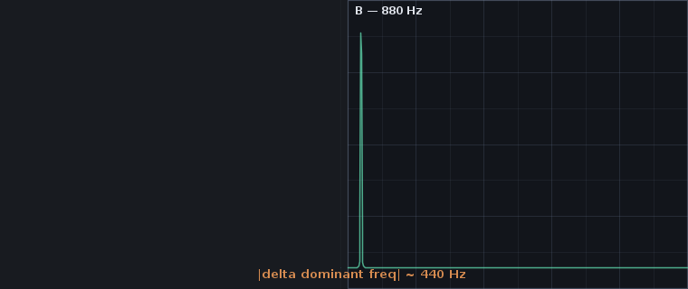

# A/B comparison of two recordings

Audio Analyzer can compare two previously captured `.aar`
[recordings](recording-and-replay.md) and produce a Markdown report summarizing measurement,
spectrum and diagnosis differences. The output is suited for QA notes, bug tickets or a regression
log.



## When to use it

- Verifying a fix: record before and after a code or hardware change and confirm the diagnosis
  findings disappear (or that the loud peak moves).
- Acceptance criteria: keep a "known good" recording per device and confirm new captures match.
- Bug reports: attach two recordings and the rendered Markdown report so the recipient sees what
  changed without having to reproduce the live session.

## How to use it

1. From the **File** menu, choose **Compare two recordings...**.
2. Select recording A in the first file chooser.
3. Select recording B in the second file chooser.
4. The application replays both files through the standard analyzer stack and renders a Markdown
   report.
5. Either save the report to disk or preview it in a dialog. Either way it is plain Markdown — no
   external service is contacted.

## What the report contains

For each side (A, B), the report records the label, audio format, total duration and frame count,
followed by three comparison sections:

- **Measurements** — RMS, peak level, dominant frequency, stereo correlation (when available),
  clipping flag, with the absolute difference per metric.
- **Spectrum summary** — FFT bin count, peak magnitude and spectral centroid for each side.
- **Diagnosis findings** — the full ordered list of findings from each side's
  [`DiagnosisAnalyzer`](../../audio-dsp/src/main/java/org/hammer/audio/diagnosis/DiagnosisAnalyzer.java)
  run, including severity, type, message and confidence.

Example excerpt for a 440 Hz vs 880 Hz comparison:

```markdown
| Metric | A | B | |Δ| |
|--------|---|---|------|
| RMS | 0.3536 | 0.3536 | 0.0000 |
| Peak level | 0.6000 | 0.6000 | 0.0000 |
| Dominant freq (Hz) | 430.7 | 861.3 | 430.6 |
```

## Programmatic use

The same machinery is available without the UI:

- [`RecordingComparator`](../../audio-app/src/main/java/org/hammer/audio/compare/RecordingComparator.java)
  — replays two `List<AudioBlock>` (or two files) through `SpectrumAnalyzer`,
  `SpectrogramAnalyzer`, `MeasurementCalculator` and `DiagnosisAnalyzer`, returning an immutable
  `ComparisonReport`.
- [`MarkdownComparisonReportRenderer`](../../audio-app/src/main/java/org/hammer/audio/compare/MarkdownComparisonReportRenderer.java)
  — renders the report as Markdown.

This means a CI job can:

1. Record a deterministic synthetic stream into a "current" `.aar`.
2. Diff it against a checked-in "expected" `.aar`.
3. Fail the job if the dominant frequency, RMS, or any diagnosis finding crosses a tolerance.

## Limitations

- The comparison reports the **final-block state** of each recording (mirroring the live "freeze
  and inspect" workflow). Time-series differences (e.g. "the click moved earlier in the second
  recording") require a richer analysis than the current report renders.
- The default FFT size is 1024; for short recordings (less than ~25 ms at 44.1 kHz) the spectrum
  side will fall back to "no spectrum snapshot" because no full block fits.
- The two recordings need not share the same audio format, but the report is most informative when
  they do — large sample-rate mismatches will dominate the spectral-centroid delta in a way that
  does not reflect content differences.

