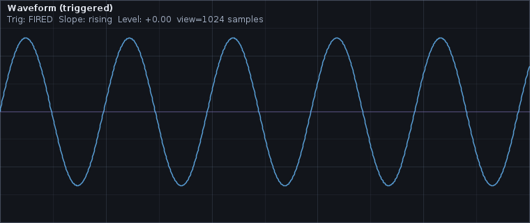

# Oscilloscope-style waveform trigger

The waveform panel can lock its display to a stable repeating point in the signal — much like a
benchtop oscilloscope — so a periodic waveform stops "sliding" across the panel and so transients
always appear at the same horizontal position. This makes it easier to inspect amplitude,
duty-cycle and shape of a tone or recurring click.

## Why use it

Without a trigger, every refresh of the waveform panel starts at an arbitrary sample boundary, so
the trace appears to scroll or flicker for any signal that does not happen to align with the block
size. With a trigger, every refresh starts at the same point in the waveform — for example, at the
first rising zero crossing of the visible window.

This is purely a display aid; it does not modify the audio that any other panel (spectrum,
spectrogram, evidence export) sees.

## How to use it

In the **File** menu of the main window:

1. Enable **Waveform: trigger (oscilloscope)**.
2. Pick a slope in **Waveform: trigger slope** (`Rising ↑` or `Falling ↓`).
3. Pick a mode in **Waveform: trigger mode**:
   - **Auto** — show a trigger event when it happens, otherwise fall back to the most recent
     samples after a short timeout. Recommended for general use; the display never freezes even
     on silence or aperiodic content.
   - **Normal** — only show a frame when a trigger event actually fires. The display stays blank
     for silence or non-periodic signals. Useful when looking at rare transients only.

While triggered, the panel title changes to **Waveform (triggered)** and a status overlay shows
whether the latest frame was a real trigger or an AUTO fallback, plus the current slope and level.

The trigger always operates on channel 0 (left) of the active capture stream.

## What it actually does

Under the hood the [`WaveformTrigger`](../../audio-dsp/src/main/java/org/hammer/audio/analysis/WaveformTrigger.java)
class keeps a small rolling history of recent samples for the configured channel. For every audio
block it:

1. Scans forward (respecting a configurable **holdoff**) for the first sample whose neighbour
   crosses the configured **level** with the configured **slope**.
2. If a crossing is found and at least `viewFrames` samples are available after it, publishes those
   samples as the triggered view.
3. If no crossing fires for more than `autoTimeoutFrames` samples and AUTO mode is selected,
   publishes the latest `viewFrames` samples anyway so the display does not freeze.

The result is a `TriggeredView` record carrying the aligned samples and the originating frame
index and timestamp — the same metadata propagated through the rest of the analyzer chain. This
keeps the trigger entirely passive: it never modifies, drops or duplicates audio in the ring buffer
that other analyzers read.

## Limitations

- Triggering operates per audio block. Very short transients that fall inside a single block but
  are shorter than `holdoffFrames` may be suppressed by the holdoff logic — increase the view size
  or reduce the holdoff for fine-grained inspection.
- The default level is `0.0` (zero crossing) and the default holdoff is 64 samples. Both can be
  changed programmatically via `WaveformPanel.getTrigger()` but are not exposed as menu sliders
  yet.
- The trigger is single-channel; stereo direction cues are better inspected with the phase diagram
  or the [stereo delay use case](../use-cases/stereo-localization.md).

