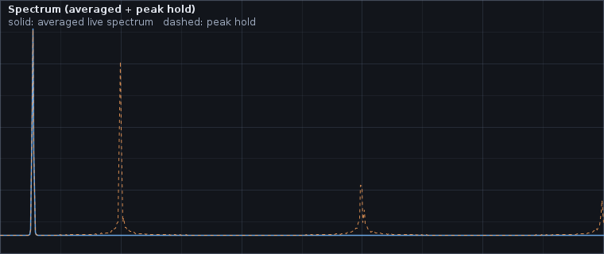

# Spectrum: peak hold and exponential averaging

The spectrum panel can present its data with two optional display modes layered on top of the
live FFT magnitudes:

- **Exponential averaging** smooths short-term variations so steady-state tones become easier to
  read.
- **Peak hold** keeps the highest magnitude ever observed at each frequency bin so transient or
  intermittent peaks remain visible after they have decayed in the live trace.

In the screenshot above the solid trace is the averaged live spectrum (a 1.2 kHz tone), while the
dashed trace shows a brief burst at ~4.4 kHz that has since decayed but is still pinned by peak
hold.

## When to use averaging

Use averaging when:

- The input is steady but noisy and you want a stable read of dominant frequencies.
- You want to read off relative levels (the ratio between two peaks) without their values jumping
  every refresh.

Avoid averaging when you specifically want to see fast transients — they will be visibly
attenuated.

## When to use peak hold

Use peak hold when:

- You are hunting for **intermittent** content: clicks, mosquito-like bursts, or rare alarms.
- You want a quick visual record of the loudest tones encountered over a session before resetting
  for a fresh measurement.

Peak hold values decay very slowly so you can leave the analyzer running and come back to a
permanent "envelope of worst case" over the recent run. Reset whenever you want to discard the
history.

## How to use it

In the **File** menu of the main window:

- Enable / disable **Spectrum: averaging** to toggle the exponential averager.
- Enable / disable **Spectrum: peak hold** to toggle the peak-hold overlay.
- Pick **Spectrum: reset peak hold** to clear the held envelope without leaving peak-hold mode.

## What it actually does

- [`SpectrumAverager`](../../audio-dsp/src/main/java/org/hammer/audio/analysis/SpectrumAverager.java)
  maintains an exponential moving average per frequency bin
  (`avg = alpha * avg + (1 - alpha) * sample`). A small alpha tracks the live signal closely; a
  larger alpha smooths more aggressively.
- [`PeakHoldSpectrum`](../../audio-dsp/src/main/java/org/hammer/audio/analysis/PeakHoldSpectrum.java)
  keeps the per-bin maximum seen so far, with an optional configurable decay factor (`peaks *=
  decay`) so very old maxima eventually fade if a session runs for hours.
- Both run inside `SpectrumDisplayState`, which is read by the spectrum panel each refresh. The
  raw FFT snapshot is unchanged — the rest of the pipeline (diagnosis, evidence export) keeps
  seeing untouched magnitudes.

## Tips

- Combine averaging *and* peak hold for the classic "stable live + remembered transients" view.
- Use **reset peak hold** before each new measurement so old session data does not bias the
  current trace.
- Peak hold is independent of the [diagnosis panel's](../../README.md) intermittent-burst
  detection, but the two complement each other: peak hold gives you the *spectral content* of a
  transient, diagnosis tells you *how often* and *when* it happened.

