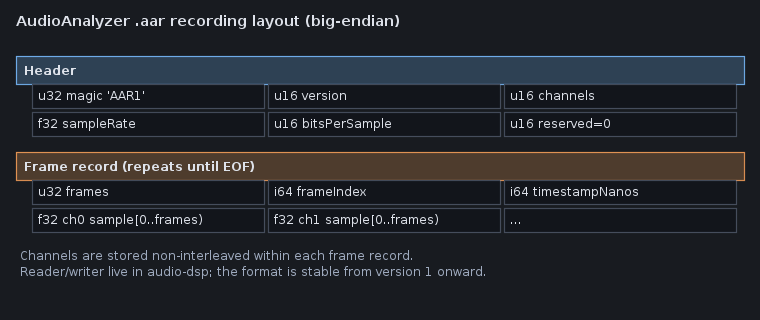

# Recording and replay

Audio Analyzer can capture every produced `AudioBlock` into a small binary file (`.aar`) and later
replay that file as if it were a live capture source. This is useful for:

- Reproducing an issue you only saw briefly on real hardware.
- Sending a minimal reproduction to a teammate without sharing the original microphone or room.
- Building a regression set: record a known good and a known bad session, then A/B compare them
  (see [A/B comparison](ab-comparison.md)).

## How to record

1. Start any capture source as usual — live microphone or a demo signal.
2. From the **File** menu, choose **Start recording...** and pick a destination file.
3. Continue analyzing as long as you like. Every block produced by the capture service is appended
   to the file.
4. Choose **Stop recording** when you are done. The dialog reports the number of blocks written.

The recording is best-effort: blocks are deduplicated by frame index, but in extreme conditions
(very fast capture rates combined with a paused UI) a few blocks may be missed. For the bundled
live capture (~10 ms blocks) the default UI poll interval is comfortably fast enough.

## How to replay

1. From the **File** menu, choose **Open recording...** and pick a `.aar` file.
2. The active capture service is stopped and replaced with a
   [`RecordedAudioCaptureService`](../../audio-app/src/main/java/org/hammer/audio/RecordedAudioCaptureService.java)
   that publishes the file's blocks at their natural sample-rate pace.
3. Every panel (waveform, spectrum, spectrogram, phase, diagnosis, measurement) behaves exactly as
   it would for live audio. Evidence export and screenshot capture work normally.

Replay does not loop by default — when the file is exhausted the service simply stops, mirroring
"Stop" on a live capture. Reopen the file to replay again.

## File format

The on-disk layout is documented on
[`AudioBlockRecordingFormat`](../../audio-dsp/src/main/java/org/hammer/audio/recording/AudioBlockRecordingFormat.java).
All integers are big-endian, samples are IEEE-754 32-bit floats in the same normalized
`[-1, 1]` convention used everywhere else in the codebase.

|       Region       |           Bytes            |                                   Contents                                   |
|--------------------|----------------------------|------------------------------------------------------------------------------|
| Header             | 16                         | magic `AAR1`, version, channel count, sample rate, bits-per-sample, reserved |
| Frame record (× N) | 20 + frames × channels × 4 | frame count, frame index, timestamp (ns), channel-major samples              |

The format is intentionally simple — it is *not* a substitute for WAV/AIFF. It exists to faithfully
round-trip blocks together with their original timestamps and frame indices so replay is
deterministic and snapshots compare identically to live captures.

## API surface

The same building blocks are usable from non-UI code:

- [`AudioBlockRecordingWriter`](../../audio-dsp/src/main/java/org/hammer/audio/recording/AudioBlockRecordingWriter.java)
  — writes blocks to any `OutputStream`.
- [`AudioBlockRecordingReader`](../../audio-dsp/src/main/java/org/hammer/audio/recording/AudioBlockRecordingReader.java)
  — streams or fully loads a recording.
- [`RecordingTap`](../../audio-app/src/main/java/org/hammer/audio/RecordingTap.java)
  — Swing-friendly wrapper that polls the current capture service.
- [`RecordedAudioCaptureService`](../../audio-app/src/main/java/org/hammer/audio/RecordedAudioCaptureService.java)
  — implements `AudioCaptureService` so a recording behaves like any other source.

Headless tools (CI gates, batch analyzers, scripted demos) can use the writer/reader directly with
no UI dependency.

## Limitations

- The format stores the *normalized* float samples that the capture service produced. It does not
  preserve the original mixer device name, the lossless source bits beyond the level information,
  or any DSP pipeline state.
- Versioning is a 16-bit field in the header: a future incompatible change must bump `VERSION`,
  and the reader refuses any file whose version does not match the supported one (not only older
  versions). The format is stable from version 1.
- Replay is from in-memory blocks — extremely long recordings may exceed available heap. Stream
  with `AudioBlockRecordingReader.next()` for those cases.

