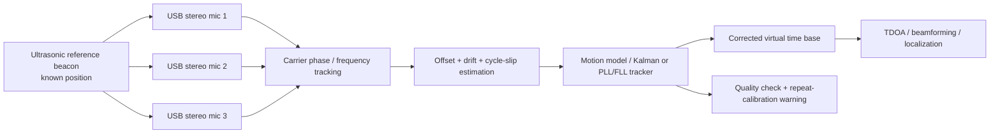

# Physics and latency limits for acoustic localization

This page explains the hard limits that apply to acoustic localization, Doppler/velocity estimation
and AR visualization for weak flying sound sources such as insect-like emitters. It is intentionally
conservative: it describes what can be improved, what can only be calibrated, and what no
implementation can overcome.

## Four classes of limits

1. **Hard physical limits:** finite speed of sound, finite aperture, finite observation time,
   reflections and weak-signal SNR limits. No implementation can remove these.
2. **Practical consumer-hardware limits:** phone microphones, independent USB microphones, small
   microphone spacing, OS buffering and display latency. Better hardware can reduce these.
3. **Calibration-reducible limits:** geometry error, channel gain mismatch, fixed offsets and some
   drift terms. Calibration can reduce them, but not eliminate residual error.
4. **AR rendering limits:** capture, processing, tracking, rendering and display all add latency. A
   predicted overlay is only as good as the motion model and confidence estimate behind it.

Nothing on this page implies guaranteed mosquito tracking or guaranteed exact AR overlay.

## Speed of sound and information latency

Acoustic localization always works on information that arrived at the microphones after the sound
propagated through air. That propagation delay is itself a hard lower bound.

- Speed of sound in air is approximately `c ≈ 343 m/s` at room temperature.
- A source 1 m away cannot be observed acoustically before roughly `1 / 343 s ≈ 2.9 ms`.
- A source 3 m away already adds roughly `8.7 ms` of propagation delay before capture and
  processing are considered.

This means the system never knows where a moving source is **now**. It only knows where the source
was when the wavefront reached the microphones.

## Sampling rate, time resolution and TDOA error

Time-difference-of-arrival (TDOA) estimation is quantized by the sample period unless sub-sample
interpolation is both implemented and reliable.

- Sample period is `Δt = 1 / sampleRate`.
- At 48 kHz, `Δt ≈ 20.8 µs`.
- One sample at 48 kHz corresponds to about `c / 48000 ≈ 7.1 mm` acoustic path difference.

That 7.1 mm figure is a **hard discretization scale** for integer-sample TDOA. Sub-sample fitting
may reduce average error in good conditions, but it does not remove the need for sufficient SNR,
bandwidth and synchronization.

Practical implications:

- small arrays can have true delays of only a few samples, so one wrong sample is already a large
  angular error;
- integer-sample TDOA is often too coarse for precise localization of weak moving sources;
- sub-sample interpolation is sensitive to noise, multipath, spectral leakage and model mismatch.

## Microphone spacing and array geometry

Array geometry sets another hard limit: the larger the microphone spacing, the larger the maximum
measurable path difference. But larger spacing also increases spatial aliasing risk, packaging
difficulty and sensitivity to reflections.

- Small spacing reduces the maximum TDOA and makes delay estimation harder.
- Large spacing improves delay leverage but can increase ambiguity and multipath sensitivity.
- Poorly measured geometry directly becomes localization bias.

Calibration can reduce geometry error, but it cannot make a badly chosen aperture behave like a
larger or better-conditioned array. For weak flying sources, rigid mounting and millimeter-scale
measurement matter because geometry errors can be comparable to the path-difference resolution.

## SNR, frequency resolution and Doppler velocity limits

Doppler estimation is limited by observation time, frequency resolution and SNR.

- Frequency resolution is `delta_f = sampleRate / FFT_size`.
- Larger FFT windows improve `delta_f`, but increase latency and assume the signal stays coherent
  over the window.
- Weak sources, blade/wingbeat modulation, harmonics and clutter often broaden peaks enough that
  the practical frequency error is worse than one FFT bin.

An approximate radial-velocity resolution is:

`delta_v ≈ c * delta_f / f_reference`

where `f_reference` is the relevant acoustic carrier or narrow-band feature.

Examples:

- At `sampleRate = 48 kHz` and `FFT_size = 4096`, `delta_f ≈ 11.7 Hz`.
- For `f_reference = 1 kHz`, this gives `delta_v ≈ 343 * 11.7 / 1000 ≈ 4.0 m/s`.
- For `f_reference = 10 kHz`, the same FFT gives `delta_v ≈ 0.40 m/s`.

So Doppler velocity estimation for insect-like sources is usually limited less by formula elegance
than by whether there is a stable narrow-band reference with enough SNR and enough observation time.

## Reflections, multipath and ambiguity

Reflections and multipath are hard environmental limits, not just implementation bugs.

- A reflected path can be stronger than the direct path.
- Multiple candidate TDOA peaks may fit the same data.
- Delay-and-sum or GCC-PHAT peaks can represent room geometry, not source truth.
- Weak flying sources near walls, tables, windows or the user can create unstable or mirrored
  solutions.

Calibration can characterize some rooms or reject some states, but it cannot guarantee unique
localization in reflective scenes. Ambiguity must therefore be treated as part of the output.

## Independent USB microphones and ultrasonic reference-beacon calibration

Independent USB microphones are a poor default for passive precision TDOA, but they can be useful in
controlled experiments when an ultrasonic reference beacon provides a continuously observed timing
reference.

### Scientific framing: beacon-aided carrier-phase synchronization

The proposed USB approach is **not** ordinary passive TDOA. It is an experimental *beacon-aided
carrier-phase synchronization* method for asynchronous low-cost acoustic arrays. Conceptually it is
closer to GNSS carrier-phase processing or PLL-aided ranging than to a classical multi-channel
microphone interface.

The method combines:

- an ultrasonic reference beacon at a known position;
- carrier-phase tracking of the beacon on every microphone;
- explicit cycle-count and cycle-slip handling;
- Doppler/frequency tracking of the beacon and of the target signal;
- a smooth-motion model (constant velocity/acceleration, or filtered);
- residual-error checks against the motion model and geometry;
- optional user-guided recalibration when residuals exceed the error budget.

Treating the problem as beacon-aided synchronization, rather than as passive TDOA on raw USB
streams, is what makes the low-cost setup tractable. It also bounds the claims that can be made:
the beacon corrects time and (within ambiguity) geometry, but target localization still inherits all
of the usual SNR, bandwidth, reflection and array-geometry limits described elsewhere on this page.

### Baseline problem

Independent USB microphones usually do not share a hardware sample clock. For passive TDOA this
creates several coupled timing errors:

- unknown relative clock offset at the start of capture;
- clock drift between devices over time;
- device and operating-system buffering latency;
- possible discontinuities when the USB stack, driver or host resamples or drops frames.

These errors can be larger than the inter-microphone delays the localization pipeline is trying to
measure. Shared-clock multi-channel audio interfaces therefore remain the preferred hardware for
precise TDOA localization.

### Hardware feasibility: ultrasonic bandwidth and sample rate

Beacon-aided carrier-phase synchronization at 35–45 kHz is only physically possible if the entire
capture chain actually passes that band. Many consumer USB microphones are designed for speech and
are mechanically, electrically or in firmware band-limited to roughly 20 kHz, which makes them
unsuitable as ultrasonic receivers regardless of the host sample rate.

Concretely, the system must verify before calibration that:

- the microphone capsule and its preamplifier have usable sensitivity in the 35–45 kHz band (check
  the manufacturer's frequency-response curve, not just the nominal "up to 20 kHz" marketing
  claim);
- the ADC and any internal DSP do not apply an anti-aliasing or "voice" filter that attenuates the
  beacon band;
- the host sample rate is high enough to satisfy Nyquist with margin — for a 40 kHz beacon this
  means strictly more than 80 kHz, and in practice 96 kHz or 192 kHz, with 192 kHz preferred to
  keep the beacon well away from the anti-alias roll-off;
- the captured spectrum actually contains beacon energy with the expected SNR at the nominal
  carrier frequency, measured on every channel before the calibration movement starts.

If any of these checks fail, the calibration must be aborted with an explicit hardware-feasibility
error rather than producing a misleading time base.

### Experimental workaround

Independent USB stereo microphones can still be useful in experiments if the setup contains a known
ultrasonic reference beacon. The beacon can be a fixed ultrasonic source at a known position, for
example a 35-45 kHz sine, multitone, chirp or coded source.

Each microphone observes the same reference signal. By tracking the beacon's phase and frequency
over time, the system can estimate:

- relative phase offset;
- sample-clock drift;
- Doppler shift caused by microphone movement;
- sudden timing discontinuities or cycle slips.

This creates a virtual timing reference from the observed carrier. It is not equivalent to a true
shared hardware clock because the estimate still depends on SNR, line of sight, propagation path,
motion modelling and cycle-count continuity.

### Recommended experimental low-cost setup

A practical low-cost experiment should prefer three stereo USB microphones over six independent mono
USB microphones. Treat each stereo device as a locally synchronized microphone pair. Arrange the
three stereo pairs with known positions and **non-coplanar, differently oriented baselines** in
3D room coordinates: ideally one baseline approximately along each of the room axes `x`, `y` and
`z`, or at minimum three baselines whose direction vectors `b1, b2, b3` span 3D space (i.e. no two
are parallel and the three are not coplanar). A typical layout places one stereo device with a
horizontal baseline along the `x`-axis, one with a baseline along the `y`-axis, and one mounted
vertically with a baseline along the `z`-axis. The combined array then observes all three spatial
directions and avoids degenerate angle-of-arrival geometry.

Calibrate and record, distinguishing **externally measured** from **beacon-estimated** quantities:

- the 3D position of every capsule — **externally measured** (tape, laser distance meter, room
  survey) for absolute accuracy; the beacon-driven carrier-phase movement can refine relative
  positions and baseline orientations once a coarse external measurement exists;
- the baseline direction and spacing inside each stereo device — **externally measured** from the
  device datasheet/mechanics;
- the fixed relative delay within each stereo device — **estimated** from the beacon, since most
  consumer stereo USB devices do not publish their intra-pair sample alignment;
- the relative delay, drift and cycle-slip state between the three USB devices — **estimated**
  continuously from the beacon (this is the core function of the carrier-phase synchronizer);
- the ultrasonic beacon position and waveform — **externally measured** for the position;
  recorded from configuration for the waveform.

Without at least a coarse external measurement of capsule positions and beacon position, the
beacon can still synchronize the devices in time, but the array geometry remains underdetermined
and absolute localization is not possible.

This is still an experimental alternative, not a replacement for shared-clock capture. The beacon
helps align the USB devices over time, while the stereo baselines provide redundant local direction
information.

### Geometry sketch: three stereo USB microphones with reference beacon

The sketch below shows the preferred low-cost layout. Three stereo USB microphones are placed at
known positions in the room with deliberately different baseline orientations, and a fixed
ultrasonic beacon `B` sits at a known reference position. Arrows indicate the guided calibration
movement: the user starts near the beacon (to acquire phase lock) and moves each microphone
smoothly toward its intended position on or near the wall before the target source is observed.

```text
y
^
|           +---------------------------- wall ----------------------------+
|           |                                                              |
|           |  S3L === S3R     (stereo 3, baseline ~ x-axis)               |
|           |   ^                                                          |
|           |   |  guided calibration arrow                                |
|           |   |                                                          |
|           |   |                            T (optional target source)    |
|           |   |                            *                             |
|           |   |                                                          |
|           |   |        S2L                                               |
|           |   |         \                                                |
|           |   |          \   (stereo 2, baseline ~ diagonal)            |
|           |   |           S2R                                            |
|           |   |          ^                                               |
|           |   |          |  guided calibration arrow                     |
|           |   |          |                                               |
|           |   |       B (ultrasonic reference beacon, known position)    |
|           |   |          |                                               |
|           |   |          v  guided calibration arrow                     |
|           |   |          |                                               |
|           |   |          S1L                                             |
|           |   |          ||  (stereo 1, baseline ~ y-axis)               |
|           |   |          S1R                                             |
|           |   |                                                          |
|           +--------------------------------------------------------------+
+----------------------------------------------------------------------> x
```

Legend:

- `B` — ultrasonic reference beacon at known position `(xB, yB, zB)`.
- `S1L / S1R`, `S2L / S2R`, `S3L / S3R` — left/right capsules of stereo USB microphones 1..3.
- Each `SiL === SiR` segment is the **local synchronized baseline** of stereo device `i`, with
  known capsule positions, baseline vector `bi` and intra-device delay model.
- The three baselines `b1, b2, b3` are intentionally oriented along different room directions
  (here roughly y, diagonal, and x) to give complementary direction information.
- Arrows indicate the **guided calibration movement** from the beacon/reference position toward the
  intended placement of each stereo device, used to unwrap carrier phase and resolve the integer
  cycle count.
- `T` — optional target source (for example a flying insect). It is observed during the tracking
  phase, after calibration has established the virtual time base.

The actual geometry must be measured in metres and stored alongside the timing model; the sketch is
illustrative only.

### Carrier-phase tracking

Carrier phase connects acoustic phase to path length. For a reference frequency `f`:

```text
lambda = c / f
Δd = N * lambda + (Δphi / 2π) * lambda
```

where `lambda` is wavelength, `N` is an integer cycle count and `Δphi` is the wrapped phase change.
At 40 kHz and `c ≈ 343 m/s`, `lambda ≈ 8.6 mm`.

Continuous phase tracking can count cycles during smooth motion and therefore provide
high-resolution relative movement information. The ambiguity is that a single pure sine is only
known modulo one wavelength after signal loss, restart or cycle slip unless a motion model or
additional reference information recovers the missing cycle count.

### Motion model and re-lock after dropouts

Short signal dropouts do not necessarily invalidate the approach. If the user moves the microphone
approximately smoothly from the reference beacon toward the target location, the system can use a
velocity/acceleration model to interpolate missing phase and frequency through the dropout.

Frequency deviation and Doppler shift provide information about radial velocity. The observed
Doppler/frequency trend before and after a dropout can help reconstruct the likely number of missed
cycles. If the reconstructed trajectory is inconsistent with the motion model, geometry or beacon
observations, the system should warn the user and ask them to repeat the calibration movement.

### Multi-frequency carriers and synthetic wavelengths

A single sine is useful for continuous carrier-phase tracking, but it is fragile after signal loss.
For robust re-acquisition, prefer one of:

- multiple ultrasonic carrier frequencies;
- chirp;
- coded beacon / PRBS / MLS-like sequence;
- sine carrier plus periodic sync marker.

Multi-frequency carriers are not just "more of the same" — they enable **synthetic-wavelength
ranging**. If the beacon transmits two close carriers `f1` and `f2` with `f2 > f1`, the phase
difference `Δφ = φ2 − φ1` behaves as if it had been measured at the much lower beat frequency
`Δf = f2 − f1`, with the corresponding synthetic wavelength

```text
lambda_synth = c / (f2 - f1)
```

Example: at `c ≈ 343 m/s`, two carriers at `f1 = 40.0 kHz` and `f2 = 40.5 kHz` give
`Δf = 500 Hz` and `lambda_synth ≈ 0.686 m`. The unambiguous one-way range is then on the order of
`lambda_synth / 2 ≈ 0.34 m`, compared to only `lambda / 2 ≈ 4.3 mm` for a single 40 kHz carrier.
This is exactly the trick used in GNSS wide-lane combinations and in optical EDM, and it is the
key mechanism for resolving cycle ambiguity after a dropout in the USB/beacon setup.

The tradeoff is noise sensitivity: any phase noise on `f1` and `f2` adds on the difference signal,
so the effective phase noise on `lambda_synth` is larger than on a single carrier. Closer
frequencies give a longer unambiguous range but worse SNR per metre. A practical recipe is to use
a **cascade**: a wide synthetic wavelength (small `Δf`) to coarsely fix the cycle integer, then
the original short wavelength of the individual carriers for fine resolution. Three or more
carriers extend this idea further but require correspondingly higher beacon bandwidth and a mic
chain that passes all of them.

### Suggested pipeline



The quality check is essential. If residual offset, drift or cycle-slip uncertainty exceeds the
localization error budget, the system should reject the calibration or mark the localization output
as demonstration-grade only.

### Practical calibration workflow

The following step-by-step protocol turns the pipeline above into a reproducible procedure. Each
step should be logged together with timestamps and quality metrics so the calibration can be
audited and repeated.

1. **Place or activate the ultrasonic beacon** at a measured, known position. Record beacon
   position, waveform (single sine, multitone, chirp, code) and nominal carrier frequency.
2. **Place each microphone near a reference position** (typically close to the beacon, in clean
   line-of-sight) and acquire phase lock on the beacon carrier.
3. **Estimate phase, carrier frequency and SNR** per channel. Reject calibration if the beacon SNR
   is below a configured threshold or if the carrier frequency disagrees with the nominal beacon
   frequency by more than the tracker bandwidth.
4. **Move the microphone smoothly** from the reference position toward its intended room position,
   following the guided calibration arrow shown in the geometry sketch. Avoid abrupt direction
   changes and rotations that break line-of-sight.
5. **Continuously unwrap phase and count cycles** during the movement, accumulating both the
   integer cycle count `N` and the wrapped phase `Δphi`.
6. **Estimate radial velocity** from the phase/frequency trend (`v_r ≈ -(c / f) * df_observed`).
   Cross-check it against the user's expected motion profile.
7. **Detect dropouts** (SNR loss, USB buffer discontinuity, occlusion) and **interpolate phase and
   frequency** through them using the velocity/acceleration motion model.
8. **Re-lock after the dropout** and verify that the reconstructed cycle count is plausible:
   the post-dropout phase, frequency and accumulated path length must be consistent with the
   pre-dropout trajectory within a configured tolerance.
9. **Store the final calibration state** per device: microphone capsule positions, baseline
   vector and intra-device delay, inter-device offset and drift parameters, residual cycle-slip
   uncertainty, and the timestamps that anchor the virtual time base.
10. **Reject or repeat the calibration** if any residual exceeds the localization error budget,
    if the reconstructed trajectory is inconsistent, or if the operator notices an unmodelled
    event (door, fan, reflection). The UI should explicitly prompt the user to repeat the
    calibration movement in that case.

Only after a successful calibration does the system enter the tracking phase for the actual target
source.

### Failure modes and mitigations

The table below lists the most common failure modes observed in beacon-aided carrier-phase
synchronization for low-cost USB arrays, together with their typical symptom and a recommended
mitigation. The mitigations are not mutually exclusive and several should usually be combined.

|                  Failure mode                   |                          Symptom                          |                                                 Mitigation                                                 |
|-------------------------------------------------|-----------------------------------------------------------|------------------------------------------------------------------------------------------------------------|
| Cycle slip                                      | Sudden integer-wavelength jump in path-length estimate    | Detect via residual against motion model; correct integer count; fall back to coded/multi-frequency beacon |
| Beacon multipath                                | Stable but biased phase; ghost peaks in delay estimate    | Use directional beacon; absorbing room treatment; multi-frequency consistency check                        |
| Low beacon SNR                                  | Noisy phase, frequent unlocks, large phase variance       | Increase beacon level; narrower tracking bandwidth; reject calibration below SNR threshold                 |
| Too abrupt user movement                        | Motion model residual spikes; loss of lock                | Slow guided movement; constrain velocity/acceleration; warn and request repeat                             |
| USB buffering discontinuity                     | Stepwise time offset; phase jump unrelated to motion      | Detect via discontinuity in beacon phase; reset offset; rely on coded beacon for re-acquisition            |
| Multiple plausible cycle counts after dropout   | Ambiguous reconstruction; several trajectories fit        | Use Doppler trend and multi-frequency beacon to disambiguate; reject if still ambiguous                    |
| Target signal confused with beacon              | Beacon tracker locks onto target harmonic                 | Keep beacon outside target band; band-pass before tracking; verify carrier frequency                       |
| Beacon outside microphone bandwidth             | No or attenuated beacon energy in the captured spectrum   | Verify microphone frequency response; pick beacon frequency in usable band; warn at startup                |
| Stereo device internally not sample-synchronous | Intra-device delay drifts; baseline geometry inconsistent | Measure intra-device delay; treat each capsule as separate device with its own offset                      |
| Temperature-dependent speed-of-sound error      | Slow systematic bias in path-length estimates             | Log ambient temperature; recompute `c` from temperature; recalibrate periodically                          |

### Beacon vs target signal, calibration vs tracking phase

To avoid confusion in implementation and documentation, four roles must be kept conceptually
separate:

- **Reference beacon signal.** A known ultrasonic waveform (sine, multitone, chirp, code) emitted
  from a known position. Its only purpose is to feed the carrier-phase / cycle-slip / drift
  estimator and to construct the virtual time base.
- **Target / insect signal.** The actual signal of interest. It is generally weak, broadband or
  modulated, and its position and motion are *unknown*. It is the quantity the user wants to
  localize.
- **Calibration phase.** The interval during which the operator follows the guided calibration
  movement so the system can lock onto the beacon, unwrap phase, resolve cycle ambiguity, and
  estimate inter-device offset, drift and intra-device delay. No target-localization output should
  be reported during this phase.
- **Tracking phase.** The interval after a successful calibration during which the beacon is still
  observed (for continuous drift correction) and the target signal is processed against the
  corrected virtual time base to produce TDOA, beamforming and localization estimates.

The beacon constructs the timing and geometric correction. It does **not** improve target SNR,
target bandwidth, room reflections or array geometry. Target localization quality therefore still
depends on the same physical limits described earlier on this page; the beacon only removes (within
its own residual error) the synchronization handicap of independent USB devices.

### Doppler sign convention and scope

Two Doppler observations occur in the pipeline and must be kept strictly separate. They have
different physical sources and different downstream uses, and confusing them will corrupt both
calibration and target tracking.

Use the standard convention for an acoustic emitter at rest and a moving receiver: when the
receiver approaches the source, the observed frequency is *higher* than the emitted frequency.
For a microphone with radial velocity `v_r` relative to the beacon (positive when moving away),

```text
f_observed = f_emitted * (1 - v_r / c)
v_r ≈ -c * (f_observed - f_emitted) / f_emitted
```

so a positive `v_r` (moving away) yields `f_observed < f_emitted` and a negative `Δf`.

1. **Doppler from microphone movement relative to the (stationary, known) beacon.** This is the
   **calibration** Doppler. Its purpose is to estimate the microphone's radial velocity along the
   line of sight to the beacon, to verify the smooth-motion model, and to reconstruct the missed
   cycle count after a dropout. It feeds the offset/drift/cycle-slip estimator.
2. **Doppler from the (moving) target signal observed by the (stationary, post-calibration)
   microphones.** This is the **target** Doppler. Its purpose is to estimate the target's radial
   velocity in the tracking phase, e.g. for insect flight analysis. It is downstream of the
   corrected virtual time base and must not be fed back into the synchronization estimator.

The two channels must be processed separately: the calibration Doppler is computed on the beacon
carrier in a narrow band around the known beacon frequency, while the target Doppler is computed
on the target signal in its own (typically lower) band. Mixing the two — for example, by feeding
target Doppler into the beacon tracker after calibration — would let target motion masquerade as
clock drift and silently bias the time base.

### Validation metrics and reject thresholds

The calibration and tracking pipeline should expose a small set of explicit metrics, both for
logging and for automatic accept/reject decisions. Suggested metrics and example reject
thresholds (to be tuned per hardware combination, not absolute):

|             Metric             |                                 Definition                                  |        Example accept range / reject trigger         |
|--------------------------------|-----------------------------------------------------------------------------|------------------------------------------------------|
| Beacon SNR (per channel)       | Peak power at beacon carrier vs. noise floor in neighbouring band           | Accept ≥ 20 dB; warn 10–20 dB; reject < 10 dB        |
| Residual phase error           | RMS of `Δphi` residual vs. motion model after PLL/FLL tracking              | Accept ≤ 0.1 cycle (≈ 36°); reject > 0.25 cycle      |
| Cycle-slip count / probability | Detected integer-cycle jumps per minute, or estimated slip probability      | Accept ≤ 1 / min during calibration; reject burst    |
| Drift                          | Estimated inter-device clock drift in ppm                                   | Accept ≤ ±50 ppm steady; reject step > 10 ppm/s      |
| Timing residual                | RMS residual of the synchronizer's time-base estimate                       | Accept ≤ 1 µs; warn 1–5 µs; reject > 5 µs            |
| Path-length residual           | Phase residual × wavelength, in millimetres                                 | Accept ≤ 1 mm (≈ 0.1 cycle at 40 kHz); reject > 5 mm |
| Localization residual          | RMS distance between predicted and observed source position on test signals | Accept ≤ 5 cm; reject > 20 cm                        |
| Beacon-frequency mismatch      | Difference between observed and nominal beacon carrier                      | Reject if larger than tracker bandwidth              |
| Hardware-feasibility check     | Beacon detected within microphone bandwidth at expected SNR                 | Reject calibration if any channel fails              |

Reject triggers should cause the system to abort or restart the calibration, prompt the operator
to repeat the guided movement, and never silently fall through to the tracking phase. Pass/fail of
each metric must be logged together with the calibration record so the experiment can be audited
later.

### References and background

The techniques used here are adapted from several mature fields. The list below points at concrete,
verifiable entry points (papers with DOIs where possible, and authoritative project pages or
encyclopedias otherwise). It is not a comprehensive bibliography.

**TDOA and GCC-PHAT**

- C. Knapp and G. Carter, "The Generalized Correlation Method for Estimation of Time Delay,"
  *IEEE Transactions on Acoustics, Speech, and Signal Processing*, vol. 24, no. 4, pp. 320–327,
  Aug. 1976. DOI: [10.1109/TASSP.1976.1162830](https://doi.org/10.1109/TASSP.1976.1162830).
- M. Brandstein and D. Ward (eds.), *Microphone Arrays: Signal Processing Techniques and
  Applications*, Springer, 2001. DOI:
  [10.1007/978-3-662-04619-7](https://doi.org/10.1007/978-3-662-04619-7).

**PLL / FLL carrier tracking**

- F. M. Gardner, *Phaselock Techniques*, 3rd ed., Wiley, 2005. ISBN 978-0-471-43063-6.
- R. E. Best, *Phase-Locked Loops: Design, Simulation, and Applications*, 6th ed., McGraw-Hill,
  2007. ISBN 978-0-07-149375-8.
- Wikipedia: [Phase-locked loop](https://en.wikipedia.org/wiki/Phase-locked_loop),
  [Carrier recovery](https://en.wikipedia.org/wiki/Carrier_recovery).

**GNSS / RTK carrier-phase ambiguity resolution and cycle slips**

- P. J. G. Teunissen, "The least-squares ambiguity decorrelation adjustment: a method for fast GPS
  integer ambiguity estimation," *Journal of Geodesy*, vol. 70, no. 1–2, pp. 65–82, 1995. DOI:
  [10.1007/BF00863419](https://doi.org/10.1007/BF00863419).
- P. Misra and P. Enge, *Global Positioning System: Signals, Measurements, and Performance*,
  2nd ed., Ganga-Jamuna Press, 2006. ISBN 978-0-9709544-1-1.
- ESA Navipedia, [Carrier Phase Cycle-Slip
  Detection](https://gssc.esa.int/navipedia/index.php/Detector_based_in_carrier_phase_data:_The_geometry-free_combination)
  and [Integer Ambiguity Resolution](https://gssc.esa.int/navipedia/index.php/Integer_Ambiguity_Resolution).
- T. Takasu and A. Yasuda, "Development of the low-cost RTK-GPS receiver with an open source
  program package RTKLIB," in *Proc. International Symposium on GPS/GNSS*, 2009. Project page:
  [RTKLIB](https://www.rtklib.com/).

**Multi-frequency / synthetic-wavelength phase ranging**

- B. Hofmann-Wellenhof, H. Lichtenegger and E. Wasle, *GNSS — Global Navigation Satellite
  Systems*, Springer, 2008, chapter on wide-lane and narrow-lane linear combinations. DOI:
  [10.1007/978-3-211-73017-1](https://doi.org/10.1007/978-3-211-73017-1).
- K. Creath, "Step height measurement using two-wavelength phase-shifting interferometry,"
  *Applied Optics*, vol. 26, no. 14, pp. 2810–2816, 1987. DOI:
  [10.1364/AO.26.002810](https://doi.org/10.1364/AO.26.002810) — canonical reference for the
  two-wavelength / synthetic-wavelength idea, here in optics but mathematically identical to the
  acoustic case.
- Wikipedia: [Electronic distance measurement](https://en.wikipedia.org/wiki/Electronic_distance_measurement).

**Asynchronous microphone-array calibration**

- N. Ono, H. Kohno, N. Ito and S. Sagayama, "Blind alignment of asynchronously recorded signals
  for distributed microphone array," in *Proc. IEEE WASPAA*, 2009, pp. 161–164. DOI:
  [10.1109/ASPAA.2009.5346505](https://doi.org/10.1109/ASPAA.2009.5346505).
- S. Markovich-Golan, S. Gannot and I. Cohen, "Blind Sampling Rate Offset Estimation and
  Compensation in Wireless Acoustic Sensor Networks with Application to Beamforming," in *Proc.
  IWAENC*, 2012. arXiv: [1209.5202](https://arxiv.org/abs/1209.5202).
- A. Plinge, S. Gannot and W. Kellermann (eds.), special issue on distributed microphone arrays
  in *IEEE Signal Processing Magazine*, vol. 33, no. 4, 2016.

**Ultrasonic ranging, chirp and coded beacons**

- N. B. Priyantha, A. Chakraborty and H. Balakrishnan, "The Cricket Location-Support System," in
  *Proc. ACM MobiCom*, 2000, pp. 32–43. DOI:
  [10.1145/345910.345917](https://doi.org/10.1145/345910.345917) — canonical coded-ultrasound
  indoor localization system.
- A. Ward, A. Jones and A. Hopper, "A new location technique for the active office," *IEEE
  Personal Communications*, vol. 4, no. 5, pp. 42–47, 1997. DOI:
  [10.1109/98.626982](https://doi.org/10.1109/98.626982).
- M. Hazas and A. Hopper, "Broadband ultrasonic location systems for improved indoor positioning,"
  *IEEE Transactions on Mobile Computing*, vol. 5, no. 5, pp. 536–547, 2006. DOI:
  [10.1109/TMC.2006.57](https://doi.org/10.1109/TMC.2006.57) — chirp/broadband ultrasonic
  ranging.

**Doppler velocity estimation**

- M. I. Skolnik, *Introduction to Radar Systems*, 3rd ed., McGraw-Hill, 2001. ISBN
  978-0-07-290980-2 — standard treatment of Doppler, directly applicable to the acoustic case.
- Wikipedia: [Doppler effect](https://en.wikipedia.org/wiki/Doppler_effect).

### Status and scope

Shared-clock multi-channel audio interfaces remain the preferred hardware for **precise** passive
TDOA. The beacon-aided carrier-phase synchronization approach described above is promising for
research and for guided low-cost experiments, but it is **not** a guaranteed production solution.
Until residual offset, drift and cycle-slip uncertainty have been characterized for a specific
hardware combination, results obtained with USB stereo microphones plus an ultrasonic beacon should
be treated as experimental and labelled accordingly in any user-facing output.

## Shared-clock multi-channel interfaces as preferred hardware

A shared-clock multi-channel interface is the preferred hardware because all channels are sampled
from one clock domain.

This does not eliminate every error source, but it removes one of the most damaging ones:
independent inter-device drift. Shared-clock capture is therefore the right baseline for serious
TDOA, beamforming and Doppler experiments.

Even with preferred hardware, calibration is still needed for:

- microphone positions;
- polarity and gain mismatch;
- fixed channel delay offsets;
- mechanical rigidity and repeatability.

## End-to-end latency: audio capture → processing → tracking → AR rendering → display

For AR, the relevant latency is not only acoustic propagation. The user sees an overlay after the
whole stack has finished:

`audio capture → buffering → processing → tracking/filtering → AR rendering → display scanout`

Practical consumer systems can easily accumulate tens of milliseconds across that chain. That means
the displayed overlay is almost always behind the real moving source unless prediction is applied.

Typical contributors:

- audio block size and driver buffering;
- FFT window length and overlap;
- CPU/GPU scheduling and OS jitter;
- tracking/filter update cadence;
- AR compositor and display refresh latency.

No implementation can make end-to-end latency disappear entirely.

## Prediction/extrapolation for AR overlays

Prediction can reduce apparent lag, but only under motion-model assumptions.

- A constant-velocity predictor works only while that approximation stays valid.
- Acceleration, turns, hovering, occlusion or identity swaps quickly invalidate extrapolation.
- A visually stable overlay can still be wrong.

Concrete scale examples:

- `1 ms` latency at `1 m/s` motion requires `1 mm` prediction.
- `50 ms` latency at `1 m/s` requires `5 cm` prediction.

Those numbers become larger at higher source speed, and they apply **in addition** to localization
error and synchronization error. Predictions are therefore not guaranteed truth; they are model-based
guesses for a display time.

## Why AR should display uncertainty regions, not exact points

AR should not imply more precision than the sensing and prediction stack can justify. An exact point
marker can falsely suggest certainty when the actual solution is a region, a ridge or multiple
hypotheses.

For research, debugging and calibration, explicit uncertainty regions are often the clearest choice.
For AR-assisted use, permanent ellipses can reduce usability, so practical overlays may encode
confidence more implicitly through marker stability, color, opacity, halo size, trail behaviour or
automatic suppression under low-confidence conditions.

Recommended interpretation:

- **high confidence:** small stable reticle;
- **medium confidence:** subtle halo, pulse or transparency change;
- **low confidence:** larger diffuse region or multiple hypotheses;
- **very low confidence:** hide the overlay instead of pretending exactness.

So the principle is not “always draw the same ellipse”. The principle is “never pretend exactness
when latency, ambiguity or tracking confidence say otherwise”.

## Practical error-budget examples

These examples show how different limits add up.

### Example 1: integer-sample TDOA at 48 kHz

- 1-sample delay error corresponds to about `7.1 mm` path-difference error.
- If geometry calibration is off by another few millimeters, the total spatial bias can already be on
  the order of centimeters depending on array layout and source direction.
- Weak-source SNR or multipath can easily add more error than the nominal sample quantization.

### Example 2: Doppler velocity resolution

- `delta_f = sampleRate / FFT_size`.
- With `48 kHz / 4096`, `delta_f ≈ 11.7 Hz`.
- Using `delta_v ≈ c * delta_f / f_reference`, the achievable radial-velocity resolution depends
  strongly on the tracked reference frequency.
- In practice, SNR, spectral leakage and non-stationary source motion usually widen the error beyond
  the bin-limited approximation.

### Example 3: AR prediction budget

- Suppose acoustic propagation is `3 ms`, audio/processing/tracking adds `20 ms`, and AR rendering
  plus display adds `27 ms`.
- End-to-end latency is then about `50 ms`.
- At `1 m/s`, that already requires `5 cm` of prediction just to compensate latency.
- If tracking confidence is poor, the correct UI response may be to enlarge/simplify the overlay or
  suppress it rather than show a precise-looking dot.

## Bottom line

Acoustic localization of weak flying sound sources is bounded by physics first, hardware second and
calibration quality third. AR visualization adds a separate latency-and-prediction problem on top of
the sensing problem. The right engineering goal is therefore not “exact guaranteed tracking”, but a
conservative system that communicates confidence honestly and avoids false precision.
